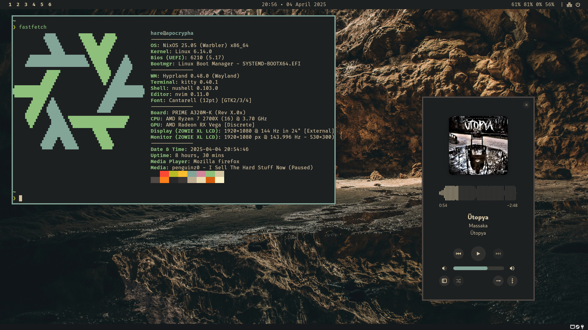

<h1 align="center">❄️ Kar ❄️</h1>

<picture>
  
</picture>

> [!NOTE]
>
> **System Information:**
>
> - **OS:** NixOS
> - **Window Manager:** Hyprland
> - **Shell:** Nu + Starship
> - **Terminal:** Kitty
> - **Editor:** Neovim
> - **Browser:** Schizofox & Floorp

## About

Personal NixOS configuration which uses Flakes and Home Manager.

## Credits

People i got inspired by (or yoinked bits from).

<a href="https://github.com/raexera">raexera</a> •
<a href="https://github.com/fufexan">fufexan</a> •
<a href="https://github.com/elkowar">elkowar</a>

